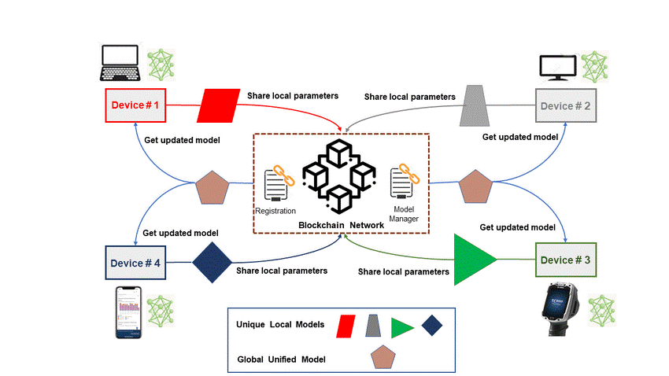
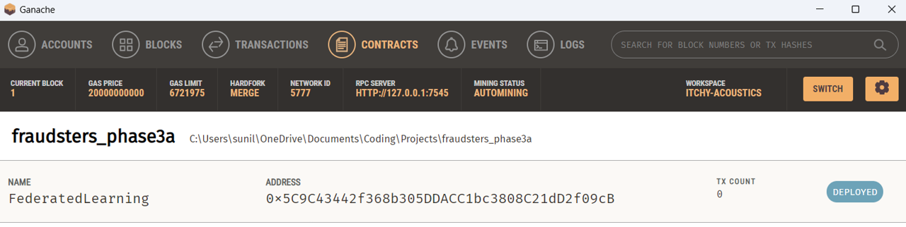
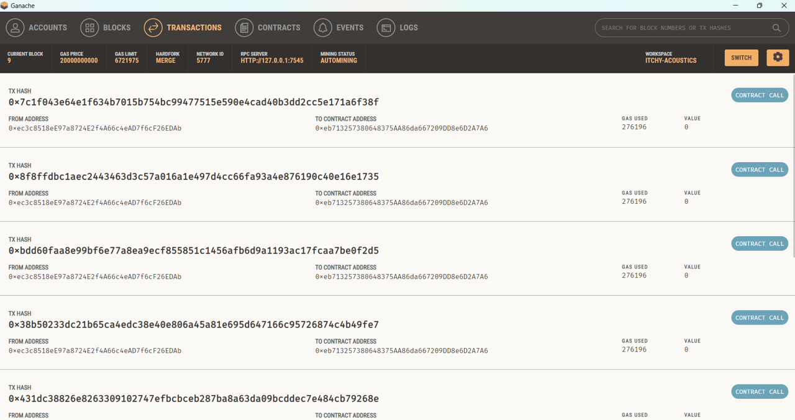
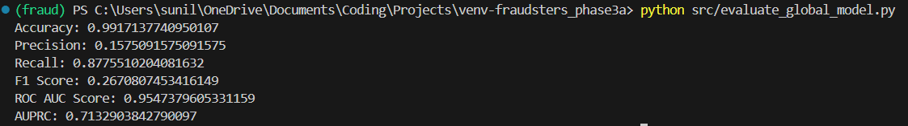

# FraudBusters - Phase 3A: Federated Learning with Blockchain

## Project Overview
This project explores advanced techniques to enhance credit card fraud detection. By leveraging the Credit Card Fraud Detection dataset, the aim is to compare the performance, complexity, and computational intensity of centralized machine learning models versus decentralized federated learning (using logistic regression). The federated learning phase of the project is then extended into two additional phases that investigate the benefits of integrating blockchain and zero knowledge proofs. 

_Visit my GitHub to view the repos of the other project phases._

## Project Objectives
- To implement and evaluate a centralized logistic regression baseline for fraud detection.
- To distribute logistic regression training across multiple clients using federated learning.
- ***[This phase]*** To secure model updates in federated learning with blockchain technology.
- To enhance privacy in federated learning with zero knowledge proofs.

_The project is a proof of concept to better understand and integrate technologies with federated learning (which is under-explored), rather than optimizing fraud detection algorithms (which are well-documented)._

# Phase 3A: Federated Learning with Blockchain

## Focus of This Phase
The objective of this phase is to implement a federated learning framework where model updates from clients are submitted to a blockchain. The blockchain ensures the integrity and transparency of the updates before they are aggregated to form a global model. 

This phase builds upon Phases 1 and 2, where a centralized logistic regression and a federated model were explored respectively. To better understand the dataset's preprocessing (i.e. applying SMOTE and cross-validation techniques), you can check out the Phase 1 write up, and similarly to learn more about federated learning, please refer to the Phase 2 write up.  

## Background

Currently, financial institutions operate using centralized models to analyze and predict financial outcomes such as fraud, loan defaults and credit risks. Each party independently collects, processes, and analyzes its data to develop predictive models. While this approach ensures that sensitive data remains within the confines of each institution, it also presents significant limitations. Centralized models can suffer from limited data diversity, leading to biased or less accurate predictions. Furthermore, this isolation inhibits collaborative innovation, as banks are unable to leverage insights from a broader dataset without compromising data privacy.

Collaboration among financial institutions could vastly improve the accuracy and robustness of predictive models. However, sharing sensitive financial data such as transaction histories, credit scores, and demographic details poses severe privacy and security risks. Regulations and the competitive nature of the financial sector further complicate data sharing, making it difficult for banks to work together to enhance their predictive analytics.

## Proposed Solution

To address these challenges, I developed a federated learning model that integrates with the Ethereum blockchain inspired by JPMorgan's [FedSyn paper](https://www.jpmorgan.com/technology/news/federated-learning-meets-blockchain). This project involves a scenario with _5 hypothetical financial institutions_. 

The objective is to collaboratively build a global logistic regression model without sharing private data, ensuring both privacy and enhanced predictive power (I chose logistic regression due to its relative simplicity and lower computational intensity compared to other algorithms).

Federated learning, a concept originally developed by Google in 2016, enables multiple parties to collaboratively train machine learning models while keeping their data localized. Each institution trains its local model on its own data and then shares the encrypted model parameters on a blockchain network. The blockchain ensures secure, transparent, and tamper-proof sharing of model parameters. The Federated Learning Coordinator then aggregates these parameters using secure methods, creating a robust global model that benefits from the diverse data sources.

This approach solves the critical problem of data privacy while fostering collaboration and innovation. By integrating blockchain technology, the project ensures that model updates are transparent and secure, building trust among participating institutions. The result is a more accurate and comprehensive predictive model that none of the institutions could have developed independently.

This federated logistic regression project demonstrates the potential for innovative solutions to overcome traditional barriers, paving the way for more effective and secure collaborative efforts in the future.

## Results and Interpretation

The global model, aggregated using federated learning and secured with blockchain, achieved notable results on the test set (bear in mind that the goal of the phase wasn't to optimize the predictions but rather prove the integration and realize the benefits for clients):

- **Accuracy: 99.17%** - High rate of correct predictions, though less informative in fraud detection due to class imbalance.
- **Precision: 15.75%** - Indicates a substantial number of false positives, highlighting the challenge of predicting fraudulent transactions.
- **Recall: 87.76%** - Successfully identified a significant portion of actual fraudulent transactions.
- **F1 Score: 0.2671** - Reflects the trade-off between precision and recall.
- **ROC AUC Score: 0.9547** - Excellent performance in distinguishing between fraudulent and non-fraudulent transactions.
- **AUPRC: 0.7133** - Average precision across recall levels, useful for imbalanced datasets like fraud detection.

## Significance & Benefits of the Proof of Concept

This project demonstrates the successful integration of machine learning with blockchain, offering several key benefits:

- **Enhanced Data Integrity and Security**: Blockchain ensures that model updates cannot be tampered with once recorded.
- **Transparency and Traceability**: Provides a transparent record of all model updates, enabling accountability.
- **Decentralized Trust**: Eliminates the need for a central authority, fostering trust among all participants.
- **Immutability**: Ensures recorded updates cannot be altered or deleted, maintaining consistency.



_Figure 1: Diagram of a generic federated learning process with blockchain integration._

## Dataset Description
**Dataset:** Credit Card Fraud Detection
- **Source:** [Kaggle](https://www.kaggle.com/mlg-ulb/creditcardfraud)
- **Description:** 
    - The dataset contains transactions made by credit cards in September 2013 by European cardholders.
    - This dataset presents transactions that occurred in two days, where we have 492 frauds out of 284,807 transactions. The dataset is highly unbalanced, the positive class (frauds) account for 0.172% of all transactions.
    - It contains only numerical input variables which are the result of a PCA transformation. Unfortunately, due to confidentiality issues, the original features and more background information about the data are not provided. 
    - Features `V1, V2, … V28` are the principal components obtained with PCA, the only features which have not been transformed with PCA are `Time` and `Amount`.
- **Features:** 
  - `Time` Number of seconds elapsed between this transaction and the first transaction in the dataset.
  - `V1-V28`: Principal components obtained with PCA.
  - `Amount`: Transaction amount.
  - `Class`: 1 for fraudulent transactions, 0 otherwise.
- **Descriptive Statistics:** 
  - Total transactions: 284,807
  - Fraudulent transactions: 492
  - Non-fraudulent transactions: 284,315
- **How The Dataset Was Used Within The Phase:**
  - Firstly, the dataset was split into a local training and global test set.
  - The local model training set was then split into 5 subsets (representing the five privately stored datasets of the financial institutions). 
  - Each subset was stratified to hold similar quantities of fraudulent transactions to ensure adequate model training.
  - The local models were then trained, submitted on-chain and aggregated to form a global model. This new global model was evaluated on the global test set.

## Blockchain Tech Used in Phase 3A
### Truffle
A development framework for Ethereum that makes it easier to manage and deploy smart contracts.

### Ganache
A personal blockchain for Ethereum development that allows you to deploy contracts, develop applications, and run tests.

## Detailed Execution Steps

### 1. Setting Up the Blockchain
- Create and deploy a smart contract using Truffle and Ganache.


_Figure 2: Screenshot of the deployed smart contract on Ganache._

### 2. Data Preparation
- Load and preprocess the dataset.
- Split the data into5 subsets to simulate multiple clients/financial institutions.

### 3. Local Model Training
- Train local models with SMOTE for handling class imbalance.
- This simulates each financial institution developing their own centralized model on their private data

### 4. Submit Model Updates to Blockchain
- Submit model updates to the blockchain.
- Only the five permissioned clients have the rights to submit to the _FederatedLearning_ smart contract
- Only model parameters are shared, preserving data privacy


_Figure 3: Screenshot of the submitted local model updates on Ganache._

### 5. Aggregate Models from Blockchain
- Aggregate the model updates retrieved from the blockchain.
- Node participants and validators would ensure compliance to the specified protocols, and regularly monitor the submission and aggregation process.
- A coordinator (decentralized or centralized) would then aggregate the local model parameters observed on-chain using the specified methods (e.g. Federated Averaging).
- Each institution would verify the aggregated model, and the global model would then be distributed to all clients 

### 6. Evaluate Global Model
- Evaluate the performance of the global model using various metrics (e.g. Accuracy, precision, AUPRC etc.)
- The process would restart at specified intervals, allowing local models to be updated as new data becomes available.


_Figure 4: Screenshot of the global model evaluation scores._

# Code Execution Steps

## Prerequisites
1. **Python**: Ensure Python is installed (my version is 3.12.3).
2. **Virtual Environment**: Set up and activate a virtual environment.
2. **Ganache**: Install and run Ganache.

## 1. Setting Up Ganache
1. **Start Ganache**:
    - Open Ganache and create a new workspace.
    - Ensure the settings match the network configuration in `truffle-config.js` (host: `127.0.0.1`, port: `7545`).

## 2. Setting Up the Python Environment

1. **Create Virtual Environment**:
    ```powershell
    python -m venv venv-fraudbusters
    ```
    # Activate Virtual Environment:
    ```powershell
    # On Windows
    .\venv-fraudbusters\Scripts\activate

    # On macOS/Linux
    source venv-fraudbusters/bin/activate
    ```
    # Install Dependencies:
    ```powershell
    pip install -r requirements.txt
    ```
## 3. Deploy Smart Contract
1. **Navigate to Project Directory**:
    ```powershell
    cd phase3a-federated_learning_with_blockchain
    ```

2. **Compile the Smart Contract**:
    ```powershell
    truffle compile
    ```

3. **Migrate the Smart Contract**:
    ```powershell
    truffle migrate --network development
    ```

## 4. Running the Project Scripts (in order)
1. **Preprocess the Data**:
    ```powershell
    python src/data_preparation.py
    ```

2. **Run the Local Training Script**:
    ```powershell
    python src/local_training.py
    ```

3. **Submit Model Updates**:
    ```powershell
    python src/submit_updates.py
    ```

4. **Aggregate Models**:
    ```powershell
    python src/aggregate_models.py
    ```

5. **Evaluate Global Model**:
    ```powershell
    python src/evaluate_global_model.py
    ```

# Appendix

## Appendix 1: Overview of Project Phases
### Phase 1: Centralized Model using Logistic Regression
**Overview:** Understand the underlying data, and implement a centralized baseline logistic regression model to detect fraudulent transactions.
<br>

**High-level actions:**
- Load and preprocess the dataset.
- Carry out exploratory data analysis.
- Train a logistic regression model.
- Evaluate and document the model's performance.

### Phase 2: Federated Learning using Logistic Regression
**Overview:** Implement federated learning to distribute model training across multiple clients. This simulates multiple clients (i.e. other financial institutions in this case) collaboratively training a machine learning model without sharing their sensitive data. This approach enhances data privacy while leveraging the collective knowledge from multiple sources. 
<br>

**High-level actions:**
- Split the dataset into multiple subsets for different clients.
- Implement federated learning using the Federated Averaging (FedAvg) algorithm.
- Aggregate model updates from clients.
- Evaluate the global model's performance.

### Phase 3A: Federated Logistic Regression with Blockchain
**Overview:**  Federated learning allows multiple parties to collaboratively train a machine learning model without sharing their data. Blockchain can enhance federated learning by providing a decentralized and immutable ledger for tracking contributions, ensuring data integrity, and facilitating secure model aggregation.
<br>

**High-level actions:**
- Set up a local blockchain using Ganache.
- Log model updates from each client on the blockchain.
- Aggregate updates securely.
- Evaluate the global model's performance.

### Phase 3B: Federated Logistic Regression using Zero Knowledge Proofs
**Overview:** Use zero knowledge proofs to enhance privacy in federated learning. In this phase, a federated machine learning model developed similar to that in Phase 2. Integrating zero-knowledge proofs with machine learning is also known as ZKML. 
<br>

ZKML allows for the secure and private verification of ML model computations. Essentially, ZKML enables one party to prove that a computation was performed correctly on private data without revealing the data itself or the details of the computation.
<br>

**High-level actions:**
- Implement ZKPs using PyZPK or similar libraries.
- Verify model updates without revealing data.
- Aggregate verified updates.
- Evaluate the global model's performance.

## Appendix 2: Overview of Technology Concepts
_See Phase 1 & 2 write-ups for additional background and explanation of the technologies explored throughout the project_
### Logistic Regression
Logistic regression is a statistical method for binary classification. It is chosen for its simplicity and efficiency, making it suitable for implementation on a laptop with limited computational power.

### Federated Learning
 Federated learning enables multiple clients to train a model collaboratively without sharing raw data. This enhances data privacy and security.

### Blockchain
 Blockchain technology provides a secure, decentralized ledger for logging model updates. Integrating blockchain with federated learning ensures the integrity and immutability of model updates.